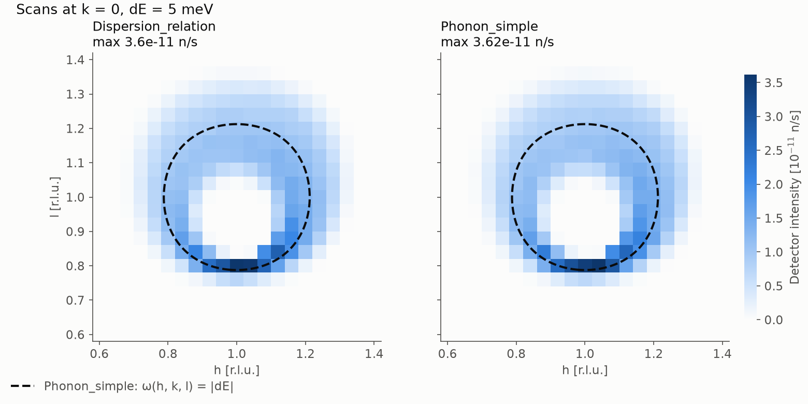
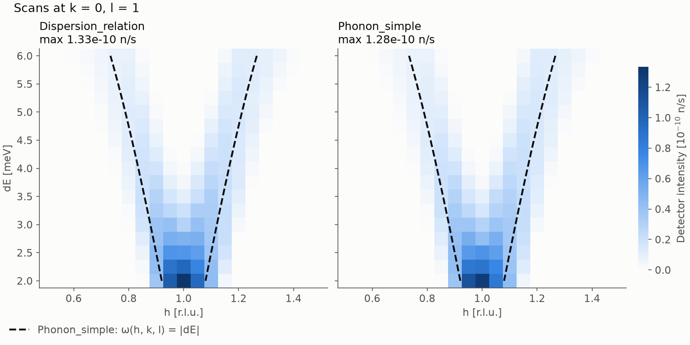
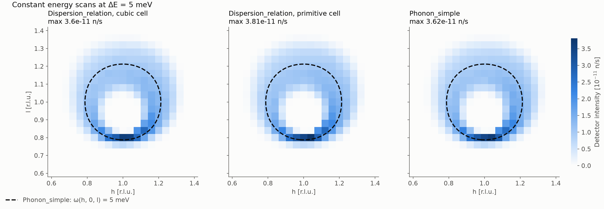
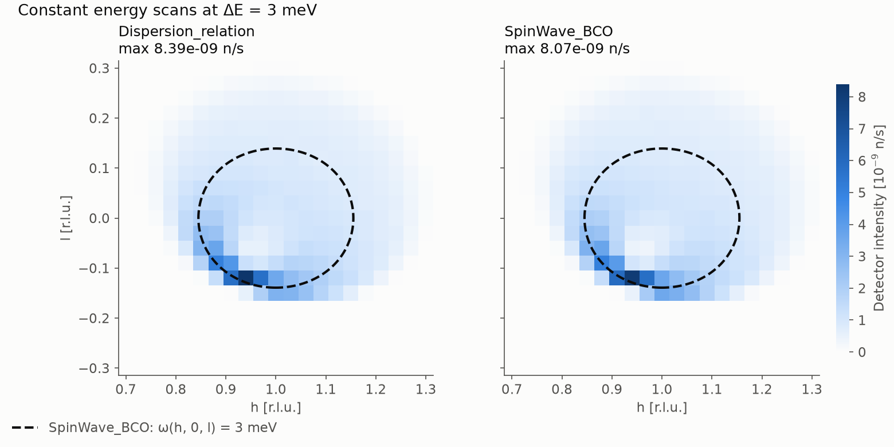
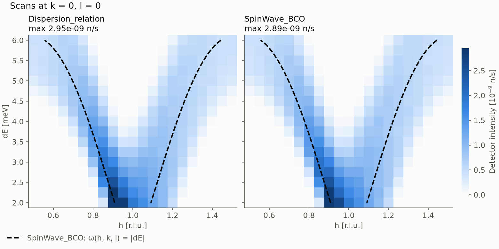

# Triple axis tests of Dispersion_relation

`Test_Dispersion_relation_TAS.instr` is a triple axis spectrometer with a flat
PG(002) monochromator and analyzer, run at fixed final energy `Ef`. For a given
`(h, 0, l)` and energy transfer `dE` it sets the monochromator, sample and
analyzer angles, so scans over `h`, `l` and `dE` map the dispersion of the
sample: a constant energy cut in (h, l), or a dispersion curve in (h, dE).

All tests use this one instrument. `sample_choice` selects the sample, which
always sits in the same position and orientation and gets the same absorption,
incoherent scattering, Debye-Waller factor and temperature (`T`, `sigma_abs`,
`sigma_inc`):

| `sample_choice` | Sample | Test |
|---|---|---|
| 0 | `Dispersion_relation` reading the Pb phonon | phonon |
| 1 | `Phonon_simple` (Pb), the phonon reference | phonon |
| 2 | `SpinWave_BCO` (MnF2), the magnon reference | magnon |
| 3 | `Dispersion_relation` reading the MnF2 magnon | magnon |

The shared functions of `SpinWave_BCO` are prefixed with `disp_SBCO_`, so that
it can be in the same instrument as `Phonon_simple`, which defines functions
with the same names.

The samples take h, k, l along the sample x, y, z axes, so the horizontal
scattering plane holds h and l. The instrument picks the lattice from
`sample_choice`:

- Phonon (0, 1): Pb, fcc with a = 4.95 Å and c = 10 meV Å in
  `Phonon_simple`. The fcc dispersion repeats every 4π/a along the cubic axes,
  so `Dispersion_relation` gets the cube of side a/2 = 2.475 Å, and h, l are in units of 4π/a: h = 1 is the fcc (2 0 0)
  reciprocal lattice vector. With `primitive_cell=1`, `Dispersion_relation`
  instead gets the primitive fcc lattice vectors (see below).
- Magnon (2, 3): MnF2 with a = b = 4.873 Å and c = 3.130 Å, given in the same
  order to both components, so h, k, l are the MnF2 indices.

## Dispersion files

The instrument writes the dispersion files that `Dispersion_relation` reads
when it is compiled, with a `SHELL` command that runs the generator scripts:
`phonon_dispersion` and `phonon_dispersion_primitive` from
`generate_phonon_dispersion.py` (the latter with `--cell primitive --points 81`)
and `magnon_dispersion` from `generate_magnon_dispersion.py`. A folder is only
written if it does not exist yet, so delete it to write it again, for example
after changing the generator. The scripts use Python 3 with numpy.

The instrument header has `%Example` lines for the McCode test tool, one per
comparison, with the detector intensity for seed 1000 and 1e6 rays, as the
test tool runs them.

## Plotting

`plot_scan.py` plots any two scanned parameters against each other, such as
(h, l) or (h, dE), one panel per scan, and draws the theoretical prediction on
top: the curve where the energy of a mode equals the energy transfer,
ω(h, k, l) = |dE|, for every mode of the reference model. Parameters that are
not axes of the plot are taken from the fixed parameters of the scan. The
reference follows `sample_choice` (the `Phonon_simple` phonon or the
`SpinWave_BCO` magnon) and can be chosen with `--reference`.

- `--x`, `--y`: the parameters on the axes; by default the two that vary.
- `--scale shared`: one absolute colour scale for all panels; otherwise each
  panel is normalised to its own maximum.

The script reads the parameters and the detector intensity of each scan point
from its own folder. The `mccode.dat` summary of the scan is not used, because
the column labels in the summary of an `mcrun -M` scan are not always in the
order of its data columns.

`-M -N 21,21` in the commands below runs the 21 × 21 grid of every combination
of the two scanned parameters.

## Phonon test against Phonon_simple

`generate_phonon_dispersion.py` writes the `Phonon_simple` dispersion of Pb to
a grid. The last column is the `Phonon_simple` cross section,
b²/(4π) · (ħ²κ²/2m_n)/ω / M per unit cell, in the form `Dispersion_relation`
reads (see the component header). It depends on the full scattering vector κ,
while the file is read at q folded into one unit cell, so the file is written
for the Brillouin zone around one reciprocal lattice point (`--zone`, default
(1, 0, 1)). It is only valid for scans in that zone.

```sh
mcrun Test_Dispersion_relation_TAS.instr -c -M -N 21,21 -n 2e5 -d hk_scan_dispersion_relation h=0.6,1.4 l=0.6,1.4 dE=5 sigma_abs=0.171 sigma_inc=0.003 sample_choice=0
mcrun Test_Dispersion_relation_TAS.instr -M -N 21,21 -n 2e5 -d hk_scan_phonon_simple h=0.6,1.4 l=0.6,1.4 dE=5 sigma_abs=0.171 sigma_inc=0.003 sample_choice=1
python plot_scan.py hk_scan_dispersion_relation hk_scan_phonon_simple --labels Dispersion_relation Phonon_simple --scale shared --output hk_scan.png
```



Both samples give a ring of intensity around the Γ point at (1, 1) that
follows the constant energy contour of `Phonon_simple` at 5 meV (dashed),
broadened by the resolution of the spectrometer:

| | `Dispersion_relation` | `Phonon_simple` |
|---|---|---|
| Total intensity over the scan (n/s) | 1.572e-9 | 1.585e-9 |
| Ring radius from intensity (r.l.u.), contour 0.215 | 0.215 | 0.215 |

The intensity maps have a correlation of 0.999, and the total intensities
differ by a ratio of 0.992 ± 0.004. That difference is the attenuation:
`Dispersion_relation` multiplies `sigma_abs` and `sigma_inc` by its density of
unit cells, 1/(a/2)³ = 8/a³, while `Phonon_simple` multiplies them by its
density of atoms, 4/a³. The same cross sections therefore attenuate twice as
strongly in `Dispersion_relation`, which for this 1 cm radius sample lowers the
intensity by a factor of 0.988. Without absorption and incoherent scattering,
the instrument default, the difference is gone.

Single points in the combined instrument, without absorption, 4 × 1e6 rays:

| (h, l) | dE (meV) | `Dispersion_relation` / `Phonon_simple` |
|---|---|---|
| (0.8, 1) | +5 | 0.992 ± 0.011 |
| (1, 0.8) | +5 | 1.008 ± 0.012 |
| (1.2, 1) | +5 | 0.986 ± 0.011 |
| (1.2, 1) | −5 (gain) | 1.001 ± 0.004 |

### Scan over h and dE

A scan over h = 0.5 to 1.5 and dE = 2 to 6 meV at l = 1 follows the phonon
dispersion along h through the zone centre (1, 0, 1), across the zone for
which the dispersion file is written. `plot_scan.py` draws the `Phonon_simple`
dispersion curve ω(h, 0, 1) on top. `-N 21,17` gives steps of 0.05 in h and
0.25 meV in dE.

```sh
mcrun Test_Dispersion_relation_TAS.instr -M -N 21,17 -n 2e5 -d hdE_scan_dispersion_relation h=0.5,1.5 l=1 dE=2,6 sample_choice=0
mcrun Test_Dispersion_relation_TAS.instr -M -N 21,17 -n 2e5 -d hdE_scan_phonon_simple h=0.5,1.5 l=1 dE=2,6 sample_choice=1
python plot_scan.py hdE_scan_dispersion_relation hdE_scan_phonon_simple --labels Dispersion_relation Phonon_simple --scale shared --output hdE_scan.png
```



Both samples follow the `Phonon_simple` dispersion (dashed), broadened by the
resolution of the spectrometer. Over the whole scan the intensities have a
ratio of 1.017 ± 0.005 and the maps a correlation of 0.998. The excess is in
the rows below 3.5 meV, but single points there with four random seeds agree
(0.981 ± 0.006 and 1.008 ± 0.007 at dE = 2.5 meV), and a finer 81³ dispersion
grid changes them by less than their uncertainty.

Single points on the dispersion curve in this scan, without absorption,
4 × 1e6 rays:

| (h, l) | dE (meV) | `Dispersion_relation` / `Phonon_simple` |
|---|---|---|
| (0.879, 1) | 3 | 0.998 ± 0.007 |
| (1.121, 1) | 3 | 0.990 ± 0.005 |
| (0.788, 1) | 5 | 0.996 ± 0.008 |
| (1.212, 1) | 5 | 0.984 ± 0.009 |

### Non-orthogonal unit cell

`Dispersion_relation` accepts any unit cell, given either by its lengths and
angles (`a, b, c, aa, bb, cc`, with a along x and b in the x-y plane) or by its
real-space lattice vectors (`ax` ... `cz`) in the component frame. It converts
the scattering vector to h = a·Q/2π, k = b·Q/2π, l = c·Q/2π and uses the density
of unit cells 1/|a·(b×c)|.

This is tested by describing the same Pb crystal with its primitive fcc cell,
a = (0, ½, ½)a, b = (½, 0, ½)a, c = (½, ½, 0)a, whose angles are 60°. With
`primitive_cell=1` the instrument gives `Dispersion_relation` these vectors and
reads `phonon_dispersion_primitive`, while h, l, the spectrometer angles and the
other samples stay as before. The dispersion file is written on the primitive
cell with `--cell primitive`, with one atom per cell, so its cross section per
cell equals the per-atom cross section of `Phonon_simple`.

```sh
mcrun Test_Dispersion_relation_TAS.instr -M -N 21,21 -n 2e5 -d hk_scan_dispersion_relation_primitive h=0.6,1.4 l=0.6,1.4 dE=5 sigma_abs=0.171 sigma_inc=0.003 sample_choice=0 primitive_cell=1
python plot_scan.py hk_scan_dispersion_relation hk_scan_dispersion_relation_primitive hk_scan_phonon_simple --labels "Dispersion_relation, cubic cell" "Dispersion_relation, primitive cell" Phonon_simple --scale shared --output hk_scan_primitive.png
```



| | Total intensity / `Phonon_simple` | Ring radius (r.l.u.) | Correlation with `Phonon_simple` |
|---|---|---|---|
| `Dispersion_relation`, cubic cell of side a/2 | 0.994 ± 0.003 | 0.215 | 0.999 |
| `Dispersion_relation`, primitive cell, 81³ grid | 1.005 ± 0.003 | 0.215 | 0.999 |

The ratios are to the mean of two `Phonon_simple` scans with different random
seeds, which differ from each other by 0.4 %. The primitive cell has the same
density as the atoms, so the attenuation difference of the cubic cell of side
a/2 is gone. With a 41³ grid the primitive cell gave 1.013 ± 0.003: its cell has
twice the volume of the cube of side a/2 and is sheared, so it needs a finer
grid for the same interpolation accuracy.

Single points in the combined instrument, without absorption, 4 × 1e6 rays:

| (h, l) | dE (meV) | primitive cell (81³) / `Phonon_simple` |
|---|---|---|
| (0.8, 1) | +5 | 0.991 ± 0.010 |
| (1, 0.8) | +5 | 0.997 ± 0.012 |
| (1.2, 1) | +5 | 0.988 ± 0.011 |
| (1.2, 1) | −5 (gain) | 1.002 ± 0.004 |

The lengths-and-angles input (a = b = c = 4.95/√2 Å, aa = bb = cc = 60°) gives
the same simulation, to the last digit, as the lattice vectors it should
produce.

## Magnon test against SpinWave_BCO

Both magnon samples use the MnF2 parameters of the `SpinWave_BCO` example
instrument: an antiferromagnet with a = b = 4.873 Å, c = 3.130 Å, j = 0.304 meV,
ja = jb = 0.008 meV, jc = −0.056 meV, D = −0.023 meV, S = 2.5 and B = 0. The
results below are at T = 2 K without absorption or incoherent scattering, as in
that example. `generate_magnon_dispersion.py` evaluates the `SpinWave_BCO`
dispersion and cross section of both antiferromagnetic modes and writes one
file per mode. The cross section contains the polarisation factor
(1 + κ_z²/κ²) and a coherence factor that change between zones, so the files
are written for the zone around (h, k, l) = (1, 0, 0), the magnetic zone
centre MnF2 (1 0 0), where the magnon gap is 1.06 meV. The band reaches
6.73 meV.

`SpinWave_BCO` searches for final speeds in `e_steps_low` and `e_steps_high`
intervals and misses roots that share an interval. The instrument uses 1000 of
each: with 200, the total intensity of the (h, l) scan below was 0.85 % lower.

```sh
mcrun Test_Dispersion_relation_TAS.instr -M -N 21,21 -n 2e5 -d hk_scan_magnon_dispersion_relation h=0.7,1.3 l=-0.3,0.3 dE=3 T=2 sample_choice=3
mcrun Test_Dispersion_relation_TAS.instr -M -N 21,21 -n 2e5 -d hk_scan_magnon_spinwave h=0.7,1.3 l=-0.3,0.3 dE=3 T=2 sample_choice=2
python plot_scan.py hk_scan_magnon_dispersion_relation hk_scan_magnon_spinwave --labels Dispersion_relation SpinWave_BCO --scale shared --output hk_scan_magnon.png
```

Detector intensity at 3 meV, with the `SpinWave_BCO` constant energy contour
(dashed):



| | `Dispersion_relation` | `SpinWave_BCO` |
|---|---|---|
| Total intensity over the scan (n/s) | 2.262e-7 | 2.246e-7 |
| Intensity weighted mean \|h − 1\| (r.l.u.) | 0.101 | 0.101 |
| Intensity weighted mean \|l\| (r.l.u.) | 0.093 | 0.094 |

The total intensities have a ratio of 1.007 ± 0.004 and the intensity maps a
correlation of 0.999. Single points in the combined instrument, 4 × 1e6 rays:

| (h, l) | dE (meV) | T (K) | `Dispersion_relation` / `SpinWave_BCO` |
|---|---|---|---|
| (0.85, 0) | +3 | 2 | 0.993 ± 0.005 |
| (1.15, 0) | +3 | 2 | 1.010 ± 0.011 |
| (1, 0.14) | +3 | 2 | 1.001 ± 0.008 |
| (1.15, 0) | −3 (gain) | 30 | 0.998 ± 0.006 |

### Scan over h and dE

A scan over h = 0.5 to 1.5 and dE = 2 to 6 meV at l = 0 follows the magnon
dispersion along h through the magnetic zone centre (1, 0, 0), where the gap is
1.06 meV, across the zone for which the dispersion files are written.
`plot_scan.py` draws the `SpinWave_BCO` dispersion curve ω(h, 0, 0) on top.
`-N 21,17` gives steps of 0.05 in h and 0.25 meV in dE.

```sh
mcrun Test_Dispersion_relation_TAS.instr -M -N 21,17 -n 2e5 -d hdE_scan_magnon_dispersion_relation h=0.5,1.5 l=0 dE=2,6 T=2 sample_choice=3
mcrun Test_Dispersion_relation_TAS.instr -M -N 21,17 -n 2e5 -d hdE_scan_magnon_spinwave h=0.5,1.5 l=0 dE=2,6 T=2 sample_choice=2
python plot_scan.py hdE_scan_magnon_dispersion_relation hdE_scan_magnon_spinwave --labels Dispersion_relation SpinWave_BCO --scale shared --output hdE_scan_magnon.png
```



Both samples follow the `SpinWave_BCO` dispersion (dashed), broadened by the
resolution of the spectrometer. Over the whole scan the intensities have a
ratio of 1.008 ± 0.003 and the maps a correlation of 0.999.

Single points on the dispersion curve in this scan, at T = 2 K, 4 × 1e6 rays:

| (h, l) | dE (meV) | `Dispersion_relation` / `SpinWave_BCO` |
|---|---|---|
| (0.845, 0) | 3 | 1.003 ± 0.006 |
| (1.155, 0) | 3 | 1.008 ± 0.007 |
| (0.697, 0) | 5 | 1.003 ± 0.006 |
| (1.303, 0) | 5 | 0.999 ± 0.006 |
