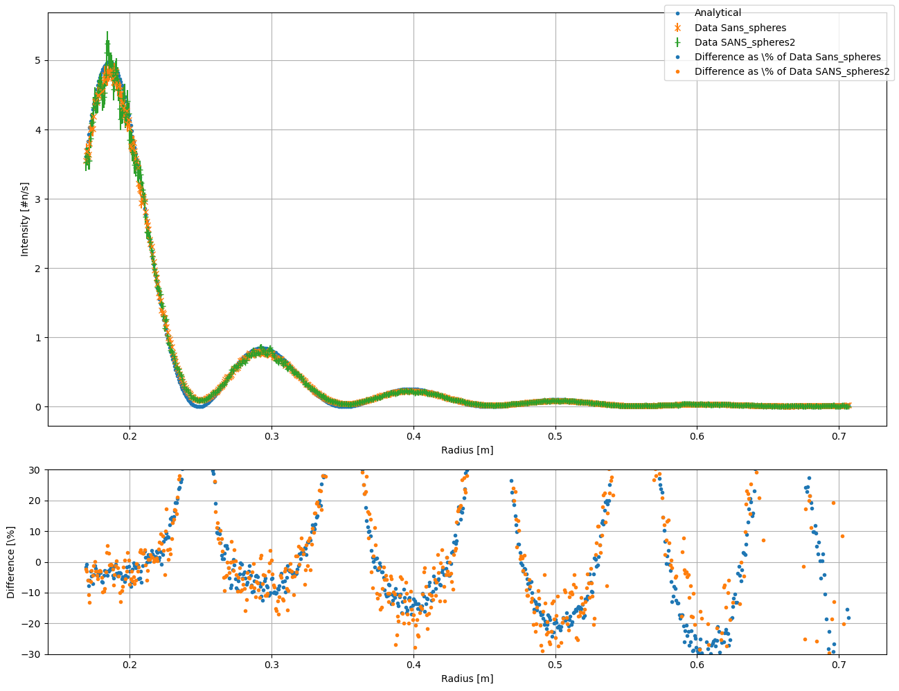
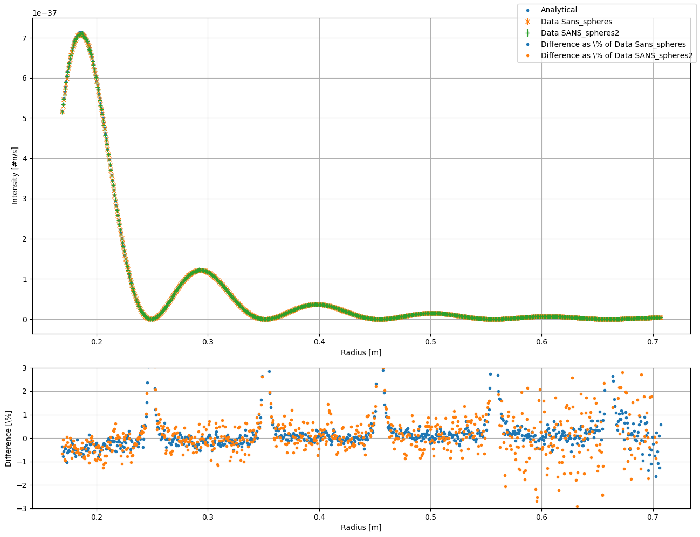

# The Test_Sans_spheres Instrument

*McStas Simple instrument used for ensuring that Sans_spheres and SANS_spheres2 remain consistent*

---

## Identification

- **Instrument:** `Test_Sans_spheres`
- **Author:** Daniel Lomholt Christensen
- **Date:** 18/08/2026
- **Origin:** Niels Bohr Institute @ UCPH
- **Instrument Site:** `Test_samples`

### Summary

A small instrument used to compare the `Sans_spheres` and `SANS_spheres2` components.


## Description

```text
This instrument is a simple SANS setup designed to simulate both the
`Sans_spheres` component and the `SANS_spheres2` component, allowing direct
verification that they produce identical results for this specific test case.
```

## Input Parameters

| Name                | Unit | Description                                                                      | Default |
| ------------------- | ---- | -------------------------------------------------------------------------------- | ------- |
| E\_i            | meV  | Energy of the simulated neutrons.                                                | -       |
| use\_SANS\_spheres2 | 1    | Selects the sample component. `0` uses `Sans_spheres`, `1` uses `SANS_spheres2`. | 0       |
| improved\_res       | 1    | Enables the instrument's high-resolution mode.                                   | 0       |
| flux\_mult          | n/s  | Multiplicative factor applied to the source flux.                                | 1       |

---
## Links

- [Source code](Test_Sans_spheres.instr) for `Test_SANS.instr`.

---


## Data treated results

The results from this instrument have been integrated azimuthally using Pyfai and compared to an analytical 
comparison. The below plots show the instrument in the normal (so called "low" resolution mode),
and in the improved\_resolution mode.

First, the normal resolution mode:



And secondly the high resolution mode:




Note, that in the high resolution mode, the neutrons will not move their complete distance through the sample, and therefore
when calculating the analytical values, the flight length that is attenuated was approximated to $0.48\cdot l_{\rm full}$ where 
$l_{\rm full}$ is the zdepth of the sample
